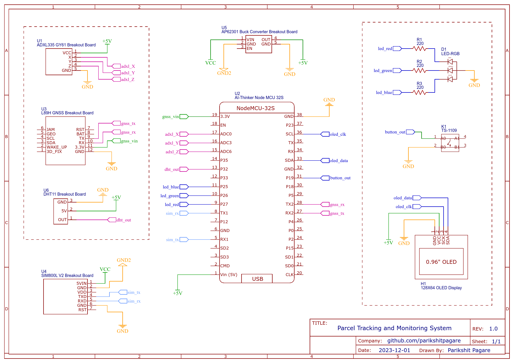

<p align="center">
   
   
   
   
   
   
</p>

<p align="center">
Parcel tracking and monitoring system developed on ESP32 microcontroller using FreeRTOS that can track location, sense vibration and monitor temperature. The system transmits data via GPRS to a web server for displaying real time updates on a website.
</p>

<br>

<p align="center">
	
</p>

<br>

# About

- A system is developed that can be used by a logistic company to track the exact location during transport of sensitive goods and also monitor the environment on a continuous basis in real time.
  
- For monitoring the environment and visualizing the data collected from all the sensors, a website is developed and deployed on a server. 
  
- The web server receives the data periodically from the GSM module and the data is displayed on the website.

- A dynamic website is implemented where a user can view updated data without the need to refresh the page. The user can see real time graphical updates as well as the previous data received
for better understanding of the conditions.

# Features

- Location Tracking using Quectel L89H GNSS module
- Temperature sensing using DHT11 sensor
- Vibration intensity sensing using ADXL335 accelerometer
- Activity monitoring on OLED display
- Dedicated Website for real time visual updates
- Wireless data transfer to Web Server using SIM800L GSM module

# Proposed System and Overview

The project implementation requires a combination of hardware and software which is developed separately.

The implementation is divided in two categories,

- Embedded System
- Web Development

## Embedded System

The Embedded system is based on a 32-bit high performance microcontroller which is the
brain of the system. For performing all the tasks simultaneously, Real Time Operating System (RTOS)
is running on top of the bare metal microcontroller. The tasks are implemented as follows,

<p align="center">
	
</p>

- For temperature monitoring a digital temperature sensor is integrated with one of the GPIO pins of the microcontroller.

- For sensing vibration a 3-axis accelerometer is integrated with ADC pins of the microcontroller which can compute the intensity of vibration in X, Y and Z axis.

- To get an exact location, a GNSS module is used which can acquire and track multiple satellite systems like GPS, IRNSS, GLONASS, BeiDou, Galileo and QZSS. The integration with microcontroller is done using UART communication protocol.

- To transmit the data collected from above sensors to a web server, a GSM module is integrated using the UART communication protocol. The data is sent to the web server wirelessly via GPRS.

- To get visual updates, a small OLED display is integrated with the microcontroller using I2C communication protocol.

- A RGB led is also used to indicate the status of the system.


## Web Development

### Web Server Overview

For transferring the data to the web server, HTTP protocol is implemented which is based on the request-response model of communication. All the data is sent from GSM module via a URL to
the web server.

- All the operations for parsing and storing the data is done at back-end which is popularly known as server-side processing.

- The client-side processing involves displaying the data on the website page which is accessible to the user.

  <p align="center">
	
</p>

# Embedded System Requirements

## Hardware

- ESP32 Microcontroller
- DHT11 Temperature sensor
- ADXL335 Accelerometer
- Quectel L89H GNSS module
- SIM800L V2.0 GSM module
- OLED display
- RGB Led

## Schematic

<p align="center">
	
</p>

## Software

To program the microcontroller **Arduino IDE** is used which is compatible with ESP32. 

### How to connect ESP32 with Arduino IDE?

- Download and install the Arduino IDE
- Install the ESP32 Library at `File -> Preference -> Additional Boards Manager URLs:` https://raw.githubusercontent.com/espressif/arduino-esp32/gh-pages/package_esp32_index.json
- Then in the `Tools -> Board Manager` -> search for ESP32 and install

### Libraries 

Certain libraries are required for proper functioning of the microcontroller and interfaced components.

<table>
  <tr>
    <th>Components/Modules</th>
    <th>Library</th>
  </tr>
  <tr>
    <td>DHT 11</td>
    <td>Adafruit Unified Sensor, Adafruit DHT Sensor</td>
  </tr>
  <tr>
    <td>L89H GNSS</td>
    <td>TinyGPSPlus</td>
  </tr>
  <tr>
    <td>OLED Display</td>
    <td>Adafruit SSD1306, Adafruit BusIO, Adafruit GFX </td>
  </tr>
</table>

<br>

<table>
  <tr>
    <th>Protocol</th>
    <th>Library</th>
  </tr>
  <tr>
    <td>UART</td>
    <td>Hardware Serial (Part of Arduino IDE)</td>
  </tr>
  <tr>
    <td>I2C</td>
    <td>Wire (Part of Arduino IDE)</td>
  </tr>
</table>

## Power

- Each sensor/module have different power requirements which need to be considered in the design. Most of the breakout boards used in the project have a voltage regulator which enables use of common voltage of 5V available on the microcontroller development board itself.

- But there is a limitation of current that can be drawn from the microcontroller. To tackle this problem, two **18650 Li-Ion batteries** coupled with a **AP62301 5V 2A buck converter** is implemented.

# Web Development Requirements

## Hardware

For the website to be online and available, it is required to be hosted on a server. There are two options that can be implemented.

- Shared Hosting (GoDaddy, Hostinger, etc.).
- Virtual Private Server (VPS) which is provided as ‘Infrastructure as a Service (IaaS)’ by many vendors (Digital Ocean, Linode, etc.).

The website for this project is deployed on a VPS provided by Digital Ocean.

## Web Application Stack

The VPS is a bare-metal server with an operating system installed on top of it. For deploying the website following packages are installed,

<table>
  <tr>
    <th>Package</th>
    <th>Use</th>
  </tr>
  <tr>
    <td>Ubuntu 22.04 (LTS) x64</td>
    <td>Operating system</td>
  </tr>
  <tr>
    <td>Apache2</td>
    <td>Web server</td>
  </tr>
  <tr>
    <td>PHP</td>
    <td>Server-side scripting engine</td>
  </tr>
  <tr>
    <td>MySQL</td>
    <td>RDBMS to store all the incoming data</td>
  </tr>
  <tr>
    <td>phpMyAdmin</td>
    <td>GUI to handle the administration of MySQL over the web</td>
  </tr>
</table>

This stack is commonly known as the LAMP Stack where,

 - L : Linux
 - A : Apache
 - M : MySQL
 - P : PHP

## Dependencies

For developing the front-end and back-end of the website, few frameworks and API’s are made use of. Instead of installing a package manager to use the frameworks, the CDN’s of these frameworks are included, which are placed in the header tag of the HTML document.

<table>
  <tr>
    <th>Dependencies</th>
    <th>Use</th>
  </tr>
  <tr>
    <td>Bootstrap</td>
    <td>Front-end toolkit for front-end development</td>
  </tr>
  <tr>
    <td>jQuery</td>
    <td>JavaScript Library for simpler Javascript coding</td>
  </tr>
  <tr>
    <td>Chart.js</td>
    <td>JavaScript charting library for creating graphs and charts</td>
  </tr>
  <tr>
    <td>Datatables</td>
    <td>Plug-in for the jQuery Javascript library to build advanced tables</td>
  </tr>
  <tr>
    <td>Leaflet</td>
    <td>JavaScript library for mobile-friendly interactive maps</td>
  </tr>
</table>

# Design and Implementation

## RTOS Implementation

The Real Time Operating System (RTOS) used in this project is called FreeRTOS which is a class of RTOS that is designed to be small enough to run on a microcontroller.

<p align="center">
	
</p>

### Scheduler

- In the application developed for this project, all tasks are given same priorities giving each task equal importance. 

- Some tasks like temperature monitoring and acquiring location are given a
delay of 5000ms as there is no need for them to be executed every 1ms.

Creating a task delay in FreeRTOS using the API `vTaskDelay()`,

`vTaskDelay(5000 / portTICK_PERIOD_MS);`

### Tasks

Tasks are small pieces of code that run independently based on the scheduling algorithm implemented in the RTOS. In FreeRTOS a task is created using the API `xTaskCreatePinnedToCore()`

### Queues and Data Passing

A queue in RTOS is a kernel object that is capable of passing information between tasks without incurring overwrites from other tasks or entering into a race condition. 

<p align="center">
	
</p>

A queue has following API’s in FreeRTOS which are implemented in the application,

- `xQueueCreate()` : Create a queue.
- `xQueueSend()` : Send data through the queue.
- `xQueueRecieve()` : Receive data from the queue.

## Server Implementation

The website for this project is deployed on a Virtual Private Server(VPS) provided by the vendor Digital Ocean.

After signing up for a VPS, Digital ocean provides a virtual machine with an IP address which is used to deploy the website and make it accessible to everyone. Digital Ocean calls one of these machines as **‘droplet’**.

The VPS used for the project has following specification,

- Operating System : Ubuntu 22.04 (LTS) x64
- CPU Cores : 1
- RAM : 1GB
- Disk Space : 25 GB

### Installing the LAMP Stack on the Server using Terminal

Detailed step by step instructions are provided by Digital Ocean

- Installing LAMP on Ubuntu 22.04 - [Digital Ocean]( https://www.digitalocean.com/community/tutorials/how-to-install-linux-apache-mysql-php-lamp-stack-on-ubuntu-22-04)
- Installing phpMyAdmin on Ubuntu 22.04 - [Digital Ocean](https://www.digitalocean.com/community/tutorials/how-to-install-and-secure-phpmyadmin-on-ubuntu-22-04)

### Working of LAMP Stack on server

<p align="center">
	
</p>

## Implementation of MySQL using PHP and phpMyAdmin

When a successful request is made to the web server by the GSM module, the incoming data is stored in the MySQL database. 

To interact with the database an extension of the MySQL API called **MySQLi (MySQL Improved)** is used in the code, which is part of the PHP package.

### Database Structure

- Using the phpMyAdmin interface, a new database is created named ‘tracking-system’. 
- Inside the database, 3 tables are created each for location, temperature and vibration named **‘tbl_gps’**,**‘tbl_temp’**, **‘tbl_vib’** respectively.

The structure can been seen as follows,

<p align="center">
	
</p>

### Connecting to MySQL Database

While installing the MySQL package, a password is set in the terminal to secure the database.

So now, for connecting to the database we need to enter the `servername`, `username`, `password` and `database` name.

The connection to the database is made using the API `mysqli_connect()` which accepts the above 4 parameters,

```php
<?php
$servername = "localhost";
$username = "root";
$password = "***********";
$database = "tracking-system";

/* Connecting to the database */
$conn = mysqli_connect($servername, $username, $password, $database);
?>
```

##  Implementation of Dynamic Website on Client-Side

The data is updated dynamically in the database using PHP and MySQL. All the back-end process is done on the server which is called server-side processing.

The issue with the front-end is that all the updated data cannot be viewed by the user on the website without continuously reloading the entire page which is not a user-friendly approach. 

To tackle this issue, two ways are implemented on the client side using JavaScript which can update all the data on the website without any need for refreshing the page.

- AJAX
- Fetch API

# Integration & Working of Sensors

## Quectel L89H GNSS Module

- The Quectel L89H Global Navigation Satellite System (GNSS) module makes use of Universal Asynchronous Receiver-Transmitter (UART) communication protocol.
  
- The Rx and Tx pins of L89H GNSS module are connected to Tx and Rx pins of ESP32 microcontroller respectively as shown in figure.

<p align="center">
	
</p>

## DHT11 Temperature Sensor

- DHT11 is a simple digital temperature sensor which is easily integrated by connecting the OUT pin to the GPIO Pin 32 as seen in the figure.

<p align="center">
	
</p>

- In the application, a threshold of **32°C** is set which means anything below the threshold is considered **Ambient Temperature** and above is considered as **Critical Temperature**.

- On the embedded system platform the status is indicated with the help of an RGB LED which emits green color for Ambient Temperature and red color for Critical Temperature.

## ADXL335 Accelerometer

As required in the system, vibration is required to be computed continuously which can be best done by an accelerometer. For this ADXL335 is integrated by using 3 ADC pins of ESP32 (ADC0, ADC3 and ADC6) as seen in figure.

- The values from the accelerometer are in analog form which is required to be converted to a digital signal. 
- For conversion, it makes use of the 3 of the 16 on-board ADC channels of ESP32 which has a resolution of 12-bit that returns values between 0 to 4095.

<p align="center">
	
</p>

The process implemented for computing vibration is as follows,

1. Reading the analog pins of the microcontroller that are connected to the X, Y and Z axis of the accelerometer and converting the analog signal to digital internally.

2. Taking 50 samples every 1ms to get an average value for more accurate results and minimize noise to a minimum.

3. Comparing the change in current and previous values by taking difference (Current Value – Previous Value).

4. Storing the Current Value = Last Value before going back to Step 1 for getting new values.
   
The process goes from Step 1 to Step 4 continuously and any change is noted. Increase in difference value indicates increase in vibration and vice-versa.

In the application, a threshold of **|30|** is set which means difference in the range of -30 and 30 is considered **Low Vibration** and outside the range is considered as **High Vibration**.

On the embedded system platform the status is indicated with the help of an RGB LED which emits green color for Low Vibration and red color for High Vibration.

## SIM800L GSM Module

Similar to the GNSS module, the GSM module makes use of Universal Asynchronous Receiver-Transmitter (UART) communication protocol.

The Rx and Tx pins of SIM800L module are connected to Tx and Rx pins of ESP32
microcontroller respectively.

<p align="center">
	
</p>

###  Using HTTP Protocol for Sending Data to Web Server

There are basically two common HTTP Request methods that can be used to send data to the web server,

**GET Request:**

Using GET we can transmit the data to the server via the URL by the setting the parameters in URL itself. We send a query string using name/value pairs in the URL.

`/folder_name/page_name.php?name1=value1&name2=value2&.....`

**POST Request:**

POST does not send anything in the URL. Data sent to the server is stored in the request body of the HTTP request.

```php
POST /folder_name/page_name.php HTTP/1.1
Host: website_url.com

name1=value1&name2=value2&.....
```

In the application, GET method is used for data transmission and the exact URL is as follows,

```php
http://website-url/backend-php/db-sensors.php?lat=latValue&lon=lonValue&temp=tempValue&x=xValue&y=yValue&z=zValue
```

When request is received by the web server it sends a response which is called HTTP Response. 

If the response status code is 200 then the request was accepted successfully. If the response status is 401, 404, 601, etc. then it indicates some kind of error. There are different status codes for different issues or errors.

### Using AT Commands

AT Commands are mainly used to configure and debug modems as well as to enable network connection to a carrier in GSM, GPRS, and mobile phone modems.

For sending data from the SIM800L GSM module via GPRS using HTTP GET method we require multiple AT commands.

<table>
  <tr>
    <th>AT Command</th>
    <th>Use</th>
  </tr>
  <tr>
    <td>AT+CFUN=1</td>
    <td>Sets the level of functionality. 1=Full functionality where highest level of power is drawn</td>
  </tr>
  <tr>
    <td>AT+CGATT=1</td>
    <td>Used to attach or detach the module SIM800L to packet domain service</td>
  </tr>
  <tr>
    <td>AT+SAPBR=3,1,\"Contype\",\"GPRS\"</td>
    <td>Sets the GPRS connection parameter in the SIM800L</td>
  </tr>
  <tr>
    <td>AT+SAPBR=3,1,\"APN\",\"CMNET\"</td>
    <td>Writes the APN parameter to the SIM800L. The APN (Access Point Name) is the access point in the mobile network. The module used has the apn name ‘CMNET’.</td>
  </tr>
  <tr>
    <td>AT+SAPBR=1,1</td>
    <td>Opens the carrier with the previously defined parameters. This can be seen as the start command for GPRS.</td>
  </tr>
  <tr>
    <td>AT+HTTPINIT</td>
    <td>Initializes the HTTP service. The SIM800L will be informed that an HTTP request starts.</td>
  </tr>
  <tr>
    <td>AT+HTTPPARA=\"CID\",1</td>
    <td>Defines the carrier profile. Usually this is always 1.</td>
  </tr>
  <tr>
    <td>AT+HTTPPARA=\"URL\",\url_name"</td>
    <td>This command passes the URL to be called along with the data to be sent. It is the same format as it is entered in a web browser.</td>
  </tr>
    <tr>
    <td>AT+HTTPACTION=0</td>
    <td>With HTTPACTION the request method is defined. The following applies - 0 = GET, 1 = POST, 2 = HEAD. The response includes the status code from the server and the data length.</td>
  </tr>
</table>

### Sending Data to the Web Server

Setting up the module for data transfer using AT commands described in Table,

```cpp
sendATcommand("AT+CFUN=1", "OK", 2000);
sendATcommand("AT+CGATT=1", "OK", 2000);
sendATcommand("AT+SAPBR=3,1,\"Contype\",\"GPRS\"", "OK", 2000);
sendATcommand("AT+SAPBR=3,1,\"APN\",\"CMNET\"", "OK", 2000);
sendATcommand("AT+SAPBR=1,1", "OK", 2000);
sendATcommand("AT+HTTPINIT", "OK", 2000);
sendATcommand("AT+HTTPPARA=\"CID\",1", "OK", 1000);
```

Setting the URL and the parameters to be sent,

```cpp
url = "http://website-url/backend-php/db-sensors.php?lat=";
 // Latitude
url += lat;
url += "&lon=";
 // Longitude
url += lon;
url += "&temp=";
 // Temperature
url += temp;
url += "&x=";
 // Accelerometer X-Axis
url += vibX;
url += "&y=";
 // Accelerometer Y-Axis
url += vibY;
url += "&z=";
 // Accelerometer Z-Axis
url += vibZ;
```
Sending the entire URL to the web server using HTTPACTION=0 which is the AT command for HTTP GET method,

```cpp
GSM.print("AT+HTTPPARA=\"URL\",\"");
GSM.print(url);
sendATcommand("\"", "OK", 2000);
sendATcommand("AT+HTTPACTION=0", "0,200", 2000);
```

## OLED display

For displaying all the data received from the sensors and modules on the embedded platform itself, an OLED display is integrated with ESP32 using Inter-Integrated Circuit (I2C) communication protocol.

<p align="center">
	
</p>

I2C operates in 2 modes – Master mode and Slave Mode. In this application, ESP32 acts as the master and OLED display is the slave. As seen from figure, the slave (OLED display) and master (ESP32) are connected using SDA and SCL lines where,

- SDA (Serial Data) : Used to transfer the data from ESP32 to OLED display.
- SCL (Serial Clock) : Carries the clock signal based on which data transfer takes place.

<p align="center">
	
</p>

As we need to display multiple data including location co-ordinates, temperature and vibration intensity, it is impossible to display everything all at once on a tiny 0.96” display. 

To mitigate this problem, a tactile button is integrated which allows us to toggle between different data like pages in a book.

- The OUT pin of the button is interfaced with one of the GPIO pins of ESP32 as seen in the figure. 
  
- There is a PULL-UP resistor already implemented with the GPIO pin in ESP32 which is made use of in the code to avoid debouncing and noise, providing a clean transition at its output.

# Website 

The website is divided into 3 sections,

- Section 1: Activity Monitoring
- Section 2- Real Time Updates
- Section 3 - Previous Data

## Section 1: Activity Monitoring

This section of the website focuses on displaying the **overview of the system**. It is divided in 3 cards using HTML/CSS and each card has following data,

- **Location Card**: Displays the latitude and longitude co-ordinates along with the timestamp at which the data was received.

- **Temperature Card**: Displays the temperature status (Ambient or Critical) along with the timestamp at which the data was received.

- **Vibration Card**: Displays the vibration status (High or Low) along with the timestamp at which the data was received.

<p align="center">
	
</p>

## Section 2: Real Time Updates

This section of the website focuses on displaying data in real-time. The temperature and vibration data are plotted on a graph and the current location is indicated on a map which updates with a fixed time interval.

### Graphical Updates

- To plot graphs with the temperature and vibration data fetched from the database, a charting library based on JavaScript called **Chart.js** is used.

- It is a popular visualization library for JavaScript, and comes with a wide variety of built-in chart types like line chart, bar chart, pie chart, etc. 

- The chart type used in this application is a **Line Chart**.

<p align="center">
	
</p>

### Location Updates on Map

The latitude and longitude co-ordinates are already displayed in the Activity Monitory section of the website, but it does not display the exact location of the co-ordinates which is not user-friendly.

So, a map is included to pinpoint to the exact location of the co-ordinates with the help of Leaflet, an open-source JavaScript library for mobile-friendly interactive maps.

<p align="center">
	
</p>

## Section 3: Previous Data

This section of the website focuses on displaying all the **previous data** that is received and stored in the database. 

Since the application is about understanding the environment in which the package is being transported, it is crucial for the user to know and understand the conditions for the
entire journey. 

The user cannot access the internal MySQL database, so a front-end feature is
developed to display all the data stored in the database in the form of advanced tables using a plug-in for the jQuery JavaScript library called **DataTables**.

<p align="center">
	
</p>

## Creator

**Parikshit Pagare**

<a href="https://linkedin.com/in/parikshitpagare"></a>
<a href="https://youtube.com/@parikshitpagare"></a>
<a href="https://www.reddit.com/user/parikshitpagare"></a>
